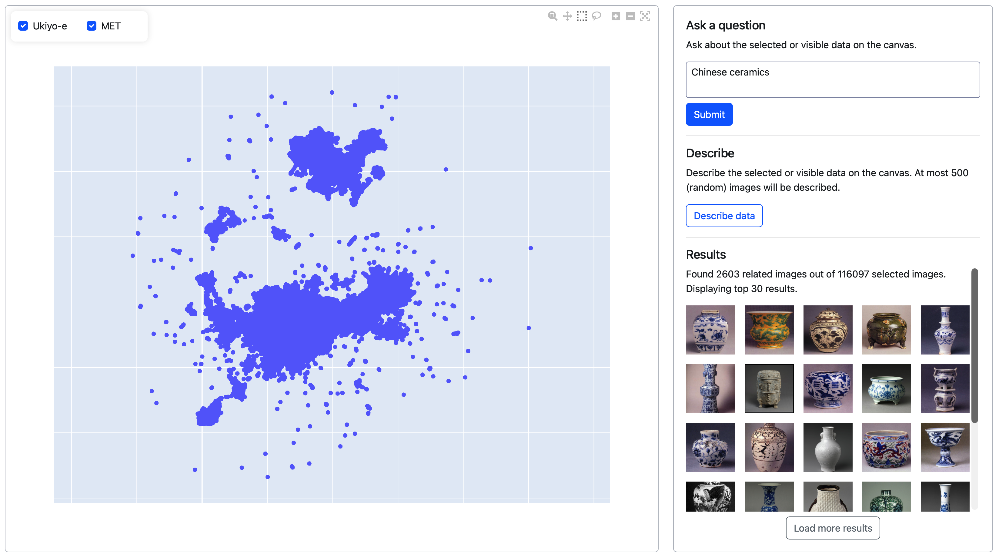

# LLM-Driven Exploration and Analytics of Digital Art Collections



[▶ Watch Demo](https://github.com/vrg-brigitta/mma2026/raw/refs/heads/master/demo.mp4)


**Abstract:** The growing digitization of museum collections has created a need
for tools that support the exploration, organization, and analysis of
large-scale artwork datasets. We present a web-based multimedia analytics
platform that enables interactive exploration of art collections through natural
language, thereby lowering the barrier for non-technical domain experts. The
system integrates a canvas-based visualization with a sidebar that supports
LLM-assisted search and analysis through natural language, as well as a describe
function that generates contextual summaries for selected or visible subsets of
the data. To support these objectives, our work makes three contributions.
First, we introduce an integrated interface for interactive exploration and
filtering of processed data (exploration), enabling inspection, querying, and
refinement of large-scale image collections through combined search, filtering,
and visual selection. Second, we propose an LLM-enhanced querying and
description component for art collections (organization), which improves
retrieval via natural-language query refinement and generates cluster-level
summaries that expose patterns and trends in metadata-driven image groups.
Third, we present a unified end-to-end framework that integrates image
processing pipelines with interactive analysis and visualization in a single
system (analysis), bridging the gap between preprocessing and exploration
workflows.


## Local
### Setup
```
git clone https://github.com/vrg-brigitta/mma2026
cd mma2026
python -m venv .venv
source .venv/bin/activate # (for Windows run: .venv\Scripts\activate)
pip install -r requirements.txt
```

### Run
On the root directory of the project run:
```
export PYTHONPATH="$PYTHONPATH:$PWD" # (for Windows run: set PYTHONPATH=%CD%)
python src/main.py
```

After the Dash server is running open http://127.0.0.1:8050/ on your browser.


## Snellius
### Connect to Snellius
```
ssh <user>@snellius.surf.nl 
```

### Setup project
```
git clone https://github.com/vrg-brigitta/mma2026
cd mma2026
python -m venv .venv
source .venv/bin/activate 
pip install -r requirements.txt
```

### Access compute node
```
srun --partition=gpu_mig --gpus=1 --ntasks=1 --cpus-per-task=1 --time=00:20:00 --pty bash -i # (other parameters are possible see instructions on Snellius below)
```

### Run server on Snellius
On the root directory of the project run:
```
export PYTHONPATH="$PYTHONPATH:$PWD" 
python src/main.py
```

### Connect to server on your local machine
```
ssh -L 8050:127.0.0.1:8050 -J <user>@snellius.surf.nl <user>@<node hostname>
```

After the Dash server is running open http://127.0.0.1:8050/ on your browser.


## Plotly and Dash tutorials
- Dash in 20 minutes: https://dash.plotly.com/tutorial
- Plotly plots gallery: https://plotly.com/python/

## Snellius tutorials
- Basics: https://uvadlc-notebooks.readthedocs.io/en/latest/tutorial_notebooks/tutorial1/Lisa_Cluster.html
- Resources: https://servicedesk.surf.nl/wiki/spaces/WIKI/pages/30660209/Snellius+partitions+and+accounting


